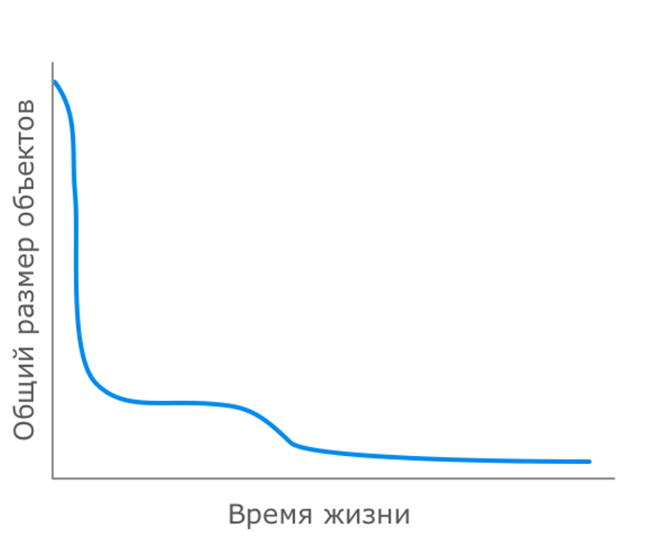

Все объекты, которые явно или неявно создаются Java-приложением, размещаются в куче. 
Над оптимизацией размещения объектов и алгоритмами их обработки разработчики языков с автоматической 
сборкой мусора бьются с первого дня их создания. И как минимум в ближайшем будущем эта битва будет продолжаться, 
ведь объемы обрабатываемых данных растут, а требования к сборке мусора у различных приложений сильно отличаются, 
что делает создание единого идеального сборщика не самым тривиальным делом.
*Сборщик мусора (GC)* - класс Java, занимающийся автоматической сборкой мусора, мусором тут выступают объекты, 
кот.больше не используются; кот.не могут быть достигнуты по ссылкам из других объектов.

Резонный вопрос. Далеко не любой программе для беспроблемной работы требуется тонкая настройка сборщика мусора. 
Очень часто выделения ей необходимого объема памяти оказывается достаточным. В конце концов, редкий пользователь 
заметит, что отклик программы время от времени занимает на сотню-другую миллисекунд дольше обычного.
Но возможно, объемы используемой вашей программой памяти таковы, что ее очистка занимает секунды, а то и 
десятки секунд. Или ваш сервис связан жестким SLA, и вы не можете позволить себе раскидываться десятками миллисекунд 
направо и налево.

*JVM разделяет используемую ею память* на две области: *куча (heap)*, в которой хранятся данные приложения, 
и *не-куча (non-heap)*, в которой хранится код программы и другие вспомогательные данные. 
В свою очередь сборщик мусора делит кучу в зависимости от своего типа.

Все объекты, которые явно или неявно создаются Java-приложением, размещаются в куче. 
Большинство приложений имеют распределение времен жизни объектов, схематично описываемое примерно такой кривой: 

т.е. подавляющее большинство объектов создаются на очень короткое время, они становятся ненужными практически 
сразу после их первого использования. Итераторы, локальные переменные методов, результаты боксинга 
и прочие временные объекты, которые зачастую создаются неявно.
Далее идут объекты, создаваемые для выполнения более-менее долгих вычислений. 
Их жизнь чуть разнообразнее — они обычно гуляют по различным методам, трансформируясь и обогащаясь в процессе, 
но после этого становятся ненужными и превращаются в мусор. Тот самый бугорок на графике.
И, наконец, объекты-старожилы, переживающие почти всех — это постоянные данные программы, загружаемые часто 
в самом начале и проживающие долгую и счастливую жизнь до остановки приложения.
Возникает идея разделения объектов на *младшее поколение (young generation)* и *старшее поколение (old generation)*. 
В соответствии с этим разделением и процессы сборки мусора разделяются на *малую сборку (minor GC)*, 
затрагивающую только младшее поколение, и *полную сборку (full GC)*, которая может затрагивать оба поколения. 
Малые сборки выполняются достаточно часто и удаляют основную часть мертвых объектов. Полные сборки выполняются тогда, 
когда текущий объем выделенной программе памяти близок к исчерпанию и малой сборкой уже не обойтись.
При этом разделение объектов по поколениям не просто условное, *они физически размещаются в разных регионах памяти.*

Эффективность работы сборщика мусора оцениваются по трем параметрам:
- Максимальная задержка — максимальное время, на которое сборщик приостанавливает выполнение программы для выполнения 
- одной сборки. Такие остановки называются *stop-the-world* (или *STW*).
- Пропускная способность — отношение общего времени работы программы к общему времени простоя, вызванного 
- сборкой мусора, на длительном промежутке времени.
- Потребляемые ресурсы — объем ресурсов процессора и/или дополнительной памяти, потребляемых сборщиком.

Парадокс здесь - по примеру теоремы CAP: добиться улучшения всех трех параметров одновременно практически невозможно. 
Уменьшение максимального времени задержки приводит к учащению сборки мусора, уменьшая пропускную способность. 
Либо приходится использовать более ухищренные алгоритмы для сохранения пропускной способности, что чаще всего 
увеличивает потребление ресурсов.

Про GC под микроскопом можно почитать тут: [habr.com/ru/articles/269621](https://habr.com/ru/articles/269621/)
