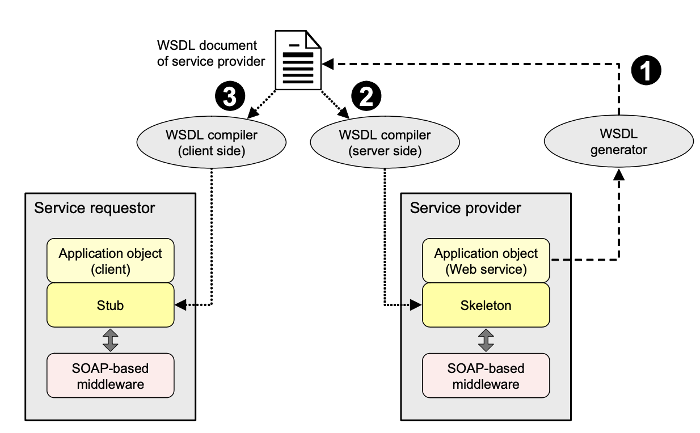

# Intro:
SOAP - это спецификация XML для отправки сообщений по сети. Сообщения SOAP не зависят ни от какой операционной системы 
и могут использовать различные протоколы связи, включая HTTP и SMTP.
SOAP отличается большим объемом XML, поэтому его лучше всего использовать с инструментами / фреймворками. 
JAX-WS - Java API для веб-служб XML - фреймворк, упрощающий использование SOAP. Он является частью стандартной Java.

Некоторые ключевые аспекты SOAP:
1. Формат сообщений: SOAP использует формат XML для кодирования сообщений, что делает его платформенно и языково независимым.
2. Транспорт: Сообщения SOAP могут передаваться через различные транспортные протоколы, включая HTTP, SMTP и даже TCP.
3. WSDL: Для описания веб-сервисов, использующих SOAP, часто применяется WSDL (Web Services Description Language).
4. Безопасность: SOAP поддерживает расширения для обеспечения безопасности, такие как WS-Security, что позволяет добавлять шифрование 
и аутентификацию в сообщения. 
5. Применение: SOAP был широко использован в начале 2000-х, но с течением времени многие разработчики перешли 
к более простым и гибким форматам, таким как REST (Representational State Transfer), особенно для веб-приложений и API. Тем не менее, 
SOAP все еще активно используется во многих корпоративных и финансовых системах, где требуется строгое соблюдение контрактов и высокий уровень безопасности.

Подробнее: https://www.baeldung.com/jax-ws

# Schema:

# Project link: 
https://github.com/IvBlack/jaxws-starter